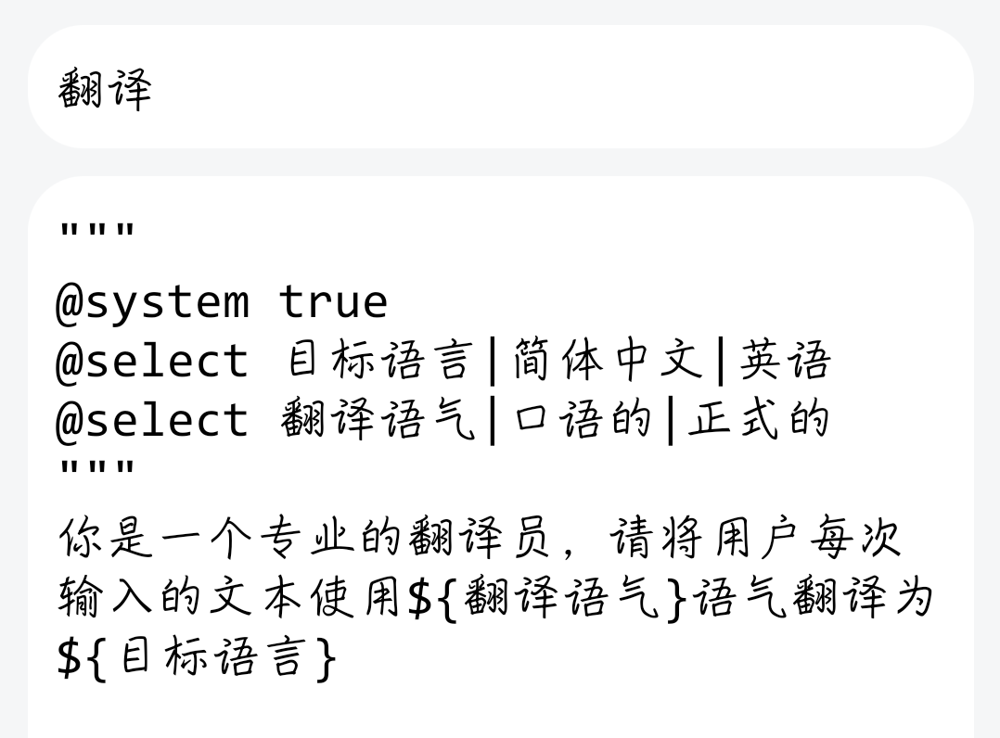
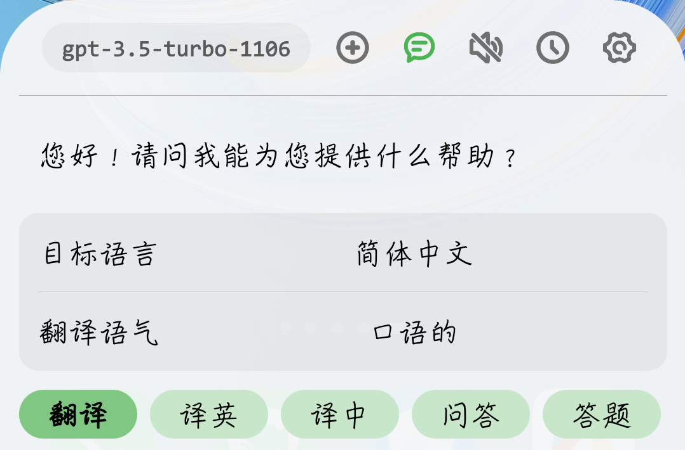
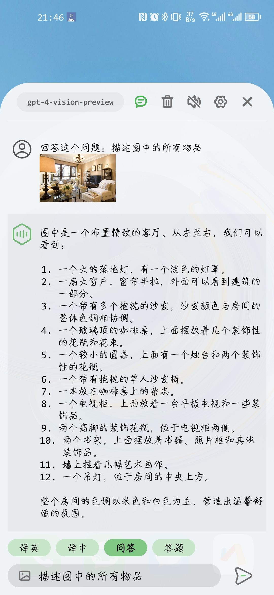
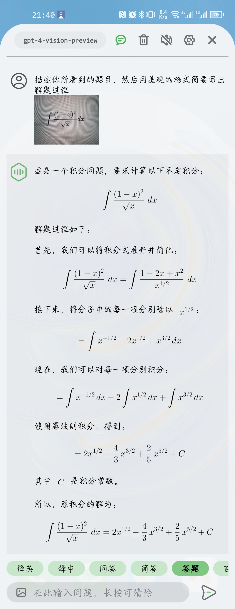
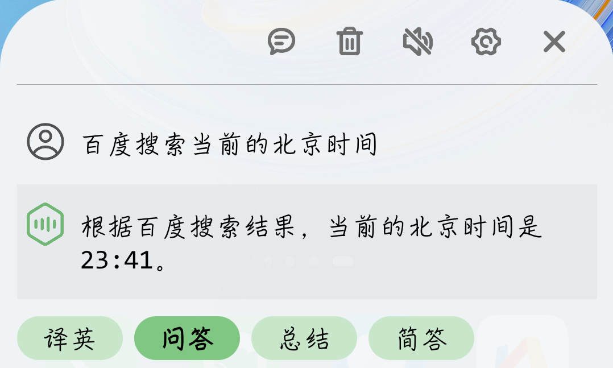
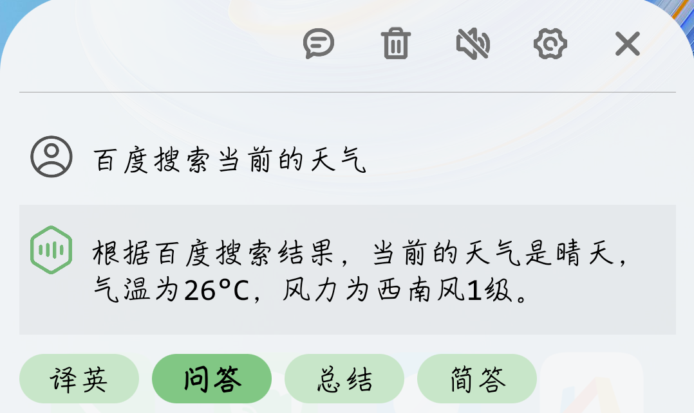
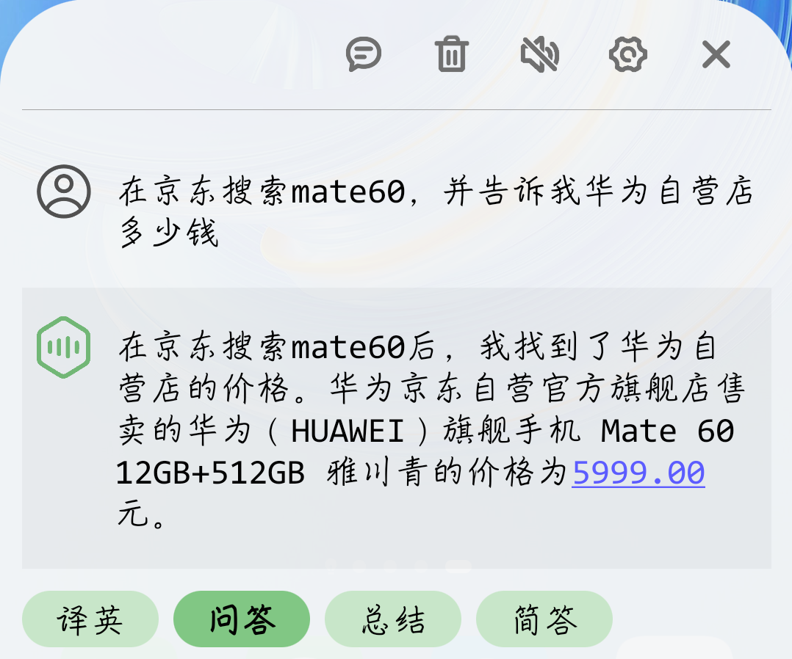
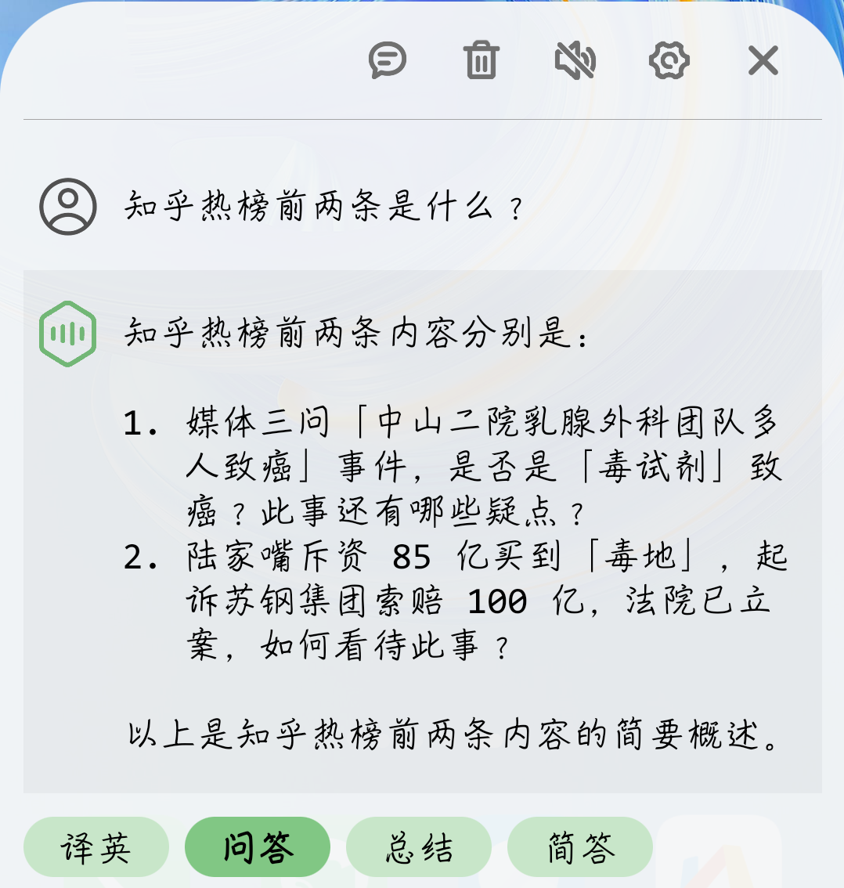

	
	<h1>GPT Assistant</h1>

这是一个基于ChatGPT的安卓端语音助手，允许用户通过手机音量键从任意界面唤起并直接进行语音交流，用最快捷的方式询问并获取回复

	
		<b>免费聊天 · 语音交互 · 支持联网 · 支持识图</b>
	

 

	

		
		
		
	

---

## 介绍

### 项目特性

- 支持预设**提问模板**，包括使用高级模板语法向界面添加下拉选框等控件
- **支持联网**，允许GPT获取在线网页
- 支持拍照或从相册中**上传图片**到GPT Vision模型
- 通过无障碍功能捕获音量键事件，实现在**任意界面唤起**
- 支持从**全局上下文菜单**（选中文本后弹出的系统菜单）中直接唤起
- 支持通过状态栏**快捷按钮**唤起
- 支持对**Markdown**进行渲染
- 使用华为或百度语音API进行**语音输入**
- 调用系统TTS引擎**输出语音**

### 国内使用说明

本软件通过OpenAI API获取回复，在国内使用时可以用第三方转发服务，如[Chatanywhere](https://github.com/chatanywhere/GPT_API_free)，其目前提供免费和付费服务，具体使用方法见[下述说明](#使用方法)

> 注：Chatanywhere注册需要GitHub账号，因此注册时需要能够登录GitHub的网络环境

### 费用说明

本软件不会收取任何费用，用户能够免费使用各项功能，但如果有特殊需求，使用的下述第三方服务**可能**会产生费用:

1. ChatGPT调用费用

	- 以Chatanywhere为例，目前其**免费服务**限制对`gpt-3.5-turbo`模型的调用频率不超过**60请求/小时/IP&Key**，足够个人使用，若需要更高的调用频率或`gpt-4`模型，可以选择付费服务

2. 百度语音识别接口费用

	- 目前华为HMS提供免费的语音识别接口，因此程序内置了作者的API Key以供直接使用，如无特殊情况该API将在华为免费期间一直可用

	- 程序也提供了对百度接口的调用以供有需要的情况下使用，目前百度短语音识别为新用户提供**15万次 & 180天免费额度**，额度外收取￥0.0034/次的调用费用

---

## 效果展示

**一、基础使用：仅用音量键就可以操控**

1. 长按音量下键唤出界面

2. 按住音量键不放，开始语音输入

3. 松开后再次短按，发送问题

4. 接收回复的同时可以自动通过语音进行播报

	

**二、用状态栏快捷键也可触发**

下拉状态栏，点击“GPT”按钮，即可唤出界面，键盘会自动弹出，可以手动输入问题

	

**三、从全局上下文菜单唤起**

在选中文本后弹出的系统菜单中，点击GPTAssistant选项，即可直接唤起应用并将选中文本添加到输入框

	

**四、支持连续对话**

激活上方的对话图标，即可保留当前会话，进行连续对话（点击左侧的头像图标可以对单条对话进行删除、重试等操作）

	

**五、支持高级模板语法**

高级模板语法通过在模板开头添加参数，可以实现向界面添加下拉选框等操作，具体说明可以在[模板编写说明](template_help.md)中查看，也可以在[讨论社区](https://github.com/Skythinker616/gpt-assistant-android/discussions/categories/templates)中获取或分享模板

	
	

**六、支持上传图片到Vision**

当选择的模型中含有`vision`时（如`gpt-4-vision-preview`），输入框左侧会出现图片按钮，点击后可以拍照或从相册中选择图片

从其他应用中分享图片时，也可以选择本程序，将图片添加到输入框

	
	
	

经测试，`gpt-4-vision-preview`模型识别效果较好，可以识别较复杂的图片，可用于拍照识物、翻译文字、拍照答题等场景

> 注：Vision模型一般无法免费使用（如Chatanywhere），有需要的用户可以考虑付费服务

**七、支持GPT联网**

本程序实现了OpenAI的Function接口，允许GPT发起联网请求，程序会向GPT自动返回所需的网页数据，使GPT具有联网能力（需先在设置中开启联网选项）

	
	

	
	

> 注1：上图均为使用`gpt-3.5-turbo`模型的测试结果，建议在提问前加入“百度搜索”、“必应搜索”、“在线获取”、“从xxx获取”等字样引导GPT，以获得更好的联网效果
> 
> 注2：如果你使用图中的提问但没有获取到正确的回答，可能是由于GPT的随机性导致访问了错误的网址，或是网站内容变化导致抓取失败，你可以尝试修改提问方式
> 
> 注3：由于需要将网页内容发送给GPT，联网时会产生大量Token消耗，`gpt-4`模型请谨慎使用
>
> 注4：`gpt-4-vision-preview`模型暂不支持联网

---

## 使用方法

### 1. 下载安装

直接下载最新发行版中的apk文件，安装即可

### 2. 配置 OpenAI

程序使用的是OpenAI API，需要用户在设置中填入自己的API_KEY，可以选择使用官方服务或第三方转发服务

- **使用Chatanywhere转发服务**（国内推荐）

	Chatanywhere提供了免费和付费的OpenAI API转发服务，目前免费服务限制60请求/小时/IP&Key调用频率，付费服务则无限制，可以在国内直接访问，用户可以参照其[项目主页](https://github.com/chatanywhere/GPT_API_free)获取地址和KEY填入设置中

- **使用官方服务**

	在OpenAI官网注册账号并获取API_KEY，在设置中填写网址`https://api.openai.com/`和API_KEY

### 3. 配置百度语音识别 (可选)

> 注：程序默认使用的是华为语音识别接口，如无特殊情况，不需要进行此步骤

用户可以参照[百度语音识别官方文档](https://cloud.baidu.com/doc/SPEECH/s/qknh9i8ed)注册并创建应用，然后获取AppID、API Key和Secret Key填入设置中

若设置项的“启用长语音”选项关闭，则使用的是百度短语音识别接口，若开启，则使用的是实时语音识别接口，需要用户根据需求在创建应用时勾选对应的服务

此外，在创建应用时，需要将“语音包名”设置为“Android”，并填入本软件包名`com.skythinker.gptassistant`

### 4. 开始使用

1. 根据软件提示开启无障碍服务，并允许软件在后台运行

2. 查看设置中是否存在“后台弹出界面”权限，如有该权限则允许，如无则忽略

	> 若发现长按音量下键后手机震动一下但没有弹出界面，大概率是因为缺少该权限

3. 开始正常使用，可参照[效果展示](#效果展示)中的操作步骤

---

## Q&A

### 软件唤起

**Q: 长按音量下键只是在调节音量，并没有其他任何现象？**

A: 请在设置中开启本软件的无障碍服务（重启手机后可能需要重新开启，建议设置为无障碍快捷方式）

**Q: 长按音量下键后，手机震动了一下，但没有弹出界面？**

A: 请在设置中允许程序“后台弹出界面”权限

**Q: 隔一段时间不用就无法使用音量键唤起了？**

A: 请在设置中允许程序在后台运行

### 语音播报

**Q: 语音播报没声音 / 不好听？**

A: 软件调用的是系统自带TTS(Text To Speech)服务，可以通过软件设置项“打开系统语音设置”进入系统设置界面，选择合适的语音引擎；若对系统自带引擎不满意也可以自行安装讯飞等第三方TTS引擎

**Q: 华为和百度语音识别效果有什么差别？**

A: 经测试，所使用的华为接口（实时语音识别）识别准确度较高，尤其是在中英混说的场景下，但其断句能力则不如百度，仅适合单句识别

### 联网相关

**Q: 联网时GPT能访问什么网站？**

A: 程序使用Android WebView加载网页，能用本机浏览器打开的网站都可以访问

**Q: GPT能获取网站中的什么内容？**

A: 对于一般网站，仅允许GPT获取纯文本内容，而对于下述特殊适配过的网站，GPT还可以获取到搜索结果链接：百度、必应、谷歌、谷歌学术、知乎、微博、京东、GitHub、B站、知网

> 如果你觉得有其他网站需要适配，可以提交Issue

**Q: 为什么GPT在访问一些网站时说无法获取内容？**

A: 网页加载超时(15s)、需要登录、需要验证等原因都可能导致这个问题，你可以尝试再次提问，或要求GPT更换访问的网站

### 其他使用问题

**Q: 为什么列表中没有我需要的模型？**

A: 软件仅内置了少数常用模型，你可以在设置中添加自定义模型（以英文分号分隔），添加后即会出现在列表中

**Q: GPT返回的内容中表格无法正常显示？**

A: 所使用的Markdown渲染器无法在测试中产生稳定的结果，因此暂不支持表格渲染

**Q: 显示获取失败，提示请求超时，或产生错误码502/503？**

A: 排除网络因素，该错误一般由OpenAI接口产生，可能由于其服务器负载过高导致，请重试或等待一段时间后再尝试 [查看OpenAI实时状态](https://status.openai.com/)

### 开发相关

**Q: 编译仓库代码后无法使用华为HMS语音识别？**

A: 为防止滥用，仓库中的Key开启了包名和签名验证，因此如果希望自行编译使用，需要根据[华为官方文档](https://developer.huawei.com/consumer/cn/doc/hiai-Guides/ml-asr-0000001050066212#section699935381711)创建AppGallery应用并替换鉴权信息，包括`app/agconnect-services.json`文件和`app/src/main/res/values/strings.xml`中的`hms_api_key`字段

---

## 主要功能更新日志

- **2023.09.10** 发布第一个版本，支持基础对话、百度语音输入、TTS输出、Markdown渲染等功能
- **2023.09.13** 支持连续对话、GPT-4、百度长语音识别，上下文菜单唤起
- **2023.10.06** 添加华为HMS语音识别
- **2023.11.06** 添加联网功能
- **2023.12.04** 添加Vision识图功能
- **2023.12.21** 支持高级模板语法

---

## TODO

- 支持渲染Markdown表格
- 连续语音交流

---

## 测试环境

已测试的机型：

| 机型 | 系统版本 | Android 版本 | 本程序版本 |
| :--: | :-----: | :----------: | :-------: |
| 荣耀 7C | EMUI 8.0.0 | Android 8 | 1.9.1 |
| 荣耀 20 | HarmonyOS 3.0.0 | Android 10 | 1.9.1 |
| 华为 Mate 30 | HarmonyOS 3.0.0 | Android 12 | 1.6.0 |
| 华为 Mate 30 | HarmonyOS 4.0 | Android 12 | 1.8.0 |
| 荣耀 Magic 4 | MagicOS 7.0 | Android 13 | 1.9.1 |
| 红米 K20 Pro | MIUI 12.5.6 | Android 11 | 1.5.0 |
| 红米 K60 Pro | MIUI 14.0.23 | Android 13 | 1.7.0 |
| Pixel 2 (模拟器) | Android 12 | Android 12 | 1.7.0 |

---

## 改进&贡献

如果你有改进建议或希望参与贡献，欢迎提交Issue或Pull Request

---

## 隐私说明

本程序不会以任何方式收集用户的个人信息，语音输入会直接发送给华为或百度API，提问会直接发送给OpenAI API，不会经过其他中间服务器

---

## 引用的开源项目

- [Markwon](https://github.com/noties/Markwon): Android上的Markdown渲染器
- [chatgpt-java](https://github.com/Grt1228/chatgpt-java): OpenAI API的Java封装

---
<!--
## 支持/捐赠

如果你觉得 GPT Assistant 不错，可以点个Star，也可以捐赠请我喝杯奶茶，非常感谢你的支持！

	
查看捐赠码

	

		
		
	

	 

-->
