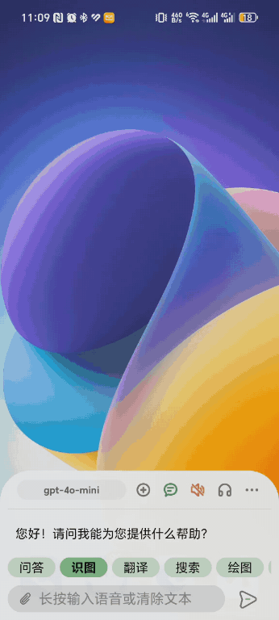
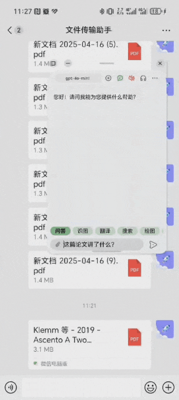

	<b>English | <a href="README.md">简体中文</a></b>

	
	<h1>GPT Assistant</h1>

	
		<b>Full-featured GPT Assistant for Android</b> 
		<b>Quick Launch · Voice Interaction · Web Access · File Upload</b>
	

 

	

		
		
		
	

---

## Introduction

### Key Features

- **Multi-scenario file processing**:
	- Upload via camera / gallery / share / open / drag & drop
	- Support for images / TXT / PDF / DOCX / PPTX / XLSX files

- **Web browsing capability**: Fetch web content as needed for GPT

- **Global quick access**: Volume key activation / status bar shortcut / cross-app text selection

- **Smart templates**: Easily customize interface for each template (custom dropdowns and input fields)

- **Multiple voice input/output interfaces**: Huawei / Baidu / Whisper / Google / System TTS

- **Fully open source**: Powered by OpenAI API (or compatible interfaces), completely free to use

---

## Feature Showcase

**1. Basic Usage: Control with just volume keys**

1. Long press the volume down key to bring up the interface
2. Hold the volume key to start voice input
3. Release and press again to send your question
4. Receive reply with automatic voice narration

	

**2. Status Bar Quick Access**

Pull down the status bar, tap the "GPT" button to bring up the interface. The keyboard will automatically appear for manual input.

	

**3. Continuous Conversation Support**

Activate the conversation icon at the top of the interface to enable continuous dialogue. Click the avatar icon on the left to delete, retry, or perform other operations on individual messages.

	

**4. Upload Text/Images/Documents**

- **In-app upload**: Click the attachment button in the bottom left to upload documents via camera, gallery, or file selection
- **Share upload**: Select text or images in other apps (like Gallery), click share, and choose this app
- **Open with**: In other apps (like WeChat/QQ), select "Open with" and choose this app
- **Drag & drop upload**: In apps that support dragging (WeChat, QQ, Super Transfer Station, PC multi-screen collaboration), drag files to this app's interface
- **Text selection**: Select text in other apps and choose this app to process it

	
	

	
	

**5. Smart Templates**

Through advanced template syntax, you can add dropdown menus and other elements to the interface. For detailed instructions, see [Template Writing Guide](template_help_en.md).

	
	

Click the button in the top right corner of the template editing page to load the online template list. You can find more templates or share your own in the [Discussion Community](https://github.com/Skythinker616/gpt-assistant-android/discussions/categories/templates). Shared templates may be dynamically updated to the online template list!

**6. Web Browsing Support**

The Function interface allows GPT to initiate web requests. The app automatically returns the required web data to GPT, giving it internet capability (must be enabled in settings first).

	
	

	
	

> Note 1: The images above show test results using the `gpt-3.5-turbo` model. For better web browsing results, include phrases like "Baidu search", "Bing search", "get online", or "retrieve from xxx" in your queries.
> 
> Note 2: If you use the same queries as shown but don't get correct answers, it might be due to GPT's randomness accessing incorrect URLs or website content changes. Try modifying your query.
> 
> Note 3: Since web content must be sent to GPT, web browsing consumes a large number of tokens. Use the `gpt-4` model cautiously.
>
> Note 4: Models that don't support Functions (like `gpt-4-vision-preview`) cannot use the web browsing feature.

---

## Installation & Configuration

### 1. Download and Install

Simply download the APK file from the latest release and install it.

### 2. Configure OpenAI

The program uses the OpenAI API, requiring users to enter their own API_KEY in settings. You can choose to use the official service or a third-party forwarding service.

- **Using the official service**

	Register an account on the OpenAI website and get an API_KEY. Enter the URL `https://api.openai.com/` and your API_KEY in the app settings.

- **Using third-party forwarding services** (for users in China)

	The official service is not directly accessible in China. Users can choose third-party forwarding services. We recommend [GPT_API_free](https://github.com/chatanywhere/GPT_API_free), which provides free access to models like `gpt-3.5-turbo` and `gpt-4o-mini`, with a limit of 200 requests/day/IP&Key, accessible within China.

### 3. Configure Voice Recognition (Optional)

> Note: The app uses Huawei voice recognition by default. This step is usually not necessary.

**Baidu Voice Recognition Interface**

Users can refer to the [Baidu Voice Recognition Official Documentation](https://cloud.baidu.com/doc/SPEECH/s/qknh9i8ed) to register and create an application, then obtain the AppID, API Key, and Secret Key to fill in the settings.

If the "Enable Long Voice" option in settings is turned off, the Baidu short voice recognition interface is used. If enabled, the real-time voice recognition interface is used. Users need to select the corresponding service when creating their application.

Additionally, when creating the application, set the "Voice Package Name" to "Android" and enter the app package name `com.skythinker.gptassistant`.

**Google Voice Recognition Interface**

Users need to ensure that [Google](https://play.google.com/store/apps/details?id=com.google.android.googlequicksearchbox) is installed on their system, then follow the app's guidance to set Google as the system voice recognition engine and allow it to use microphone permissions. Then select the Google voice recognition interface in the app settings.

**Whisper Voice Recognition Interface**

If the OpenAI interface used supports the Whisper model, simply select the Whisper voice recognition interface in the app settings.

### 4. Start Using

- If you want to use volume key activation, you need to:
	1. Enable the accessibility service as prompted by the app, and allow the app to run in the background
	2. Check if there is a "Background Pop-up Interface" permission in system settings. Allow it if available, ignore if not.

		> If you find that the phone vibrates after long-pressing the volume down key but no interface appears, it's likely due to missing this permission.

- Please refer to the operations in [Feature Showcase](#feature-showcase) to use the software.

---

## Q&A

### App Activation

**Q: Long-pressing the volume down key only adjusts the volume, with no other effect?**

A: Please enable the accessibility service for this app in system settings (may need to be re-enabled after restarting the phone).

**Q: After long-pressing the volume down key, the phone vibrates but no interface appears?**

A: Please allow the "Background Pop-up Interface" permission for the app in system settings.

**Q: Volume key activation stops working after a period of inactivity?**

A: Please allow the app to run in the background in system settings.

### Voice Interaction

**Q: No sound from voice narration / poor quality?**

A: The app uses the system's built-in TTS (Text To Speech) service. You can access system voice settings through the app settings to select an appropriate voice engine. If you're not satisfied with the built-in engines, you can install third-party TTS engines like iFlytek or [TTS Server](https://github.com/jing332/tts-server-android).

**Q: What are the differences in performance between voice recognition interfaces?**

A: Testing with Chinese and mixed Chinese-English scenarios:
- Huawei interface (real-time voice recognition) has high accuracy and performs best for single sentences
- Baidu performs well for long sentences with reasonable segmentation but struggles with mixed Chinese-English recognition (uses standard Mandarin model)
- Google supports many languages, has average Chinese recognition, and doesn't add punctuation
- Whisper supports many languages with decent Chinese recognition but sometimes has uncontrollable simplified/traditional character issues and doesn't support real-time output

For English-only scenarios, Huawei, Google, and Whisper all perform well.

**Q: What about voice recognition interface costs?**

The app currently supports four voice recognition interfaces, with Huawei (the default) being free:
- **Huawei HMS** (default interface) provides free voice recognition, so the author's API Key is built-in for direct use. This interface will remain available as long as Huawei's free period continues.
- **Google** is also free but may be inaccessible in China, recommended only for overseas users
- **Baidu** short voice recognition offers new users 150,000 calls & 180 days free quota, beyond which it costs ¥0.0034 per call
- **Whisper** interface is provided by OpenAI, using the same interface parameters as GPT chat. For costs, refer to the [official documentation](https://openai.com/pricing)

### Web Browsing Related

**Q: What websites can GPT access when browsing?**

A: The program uses Android WebView to load web pages. Any site that can be opened with your device's browser can be accessed.

**Q: What content can GPT retrieve from websites?**

A: For general websites, GPT can only retrieve plain text content. For specially adapted sites like Baidu, Bing, Google, Google Scholar, Zhihu, Weibo, JD, GitHub, Bilibili, and CNKI, GPT can also access search result links.

> If you think other websites need adaptation, please submit an Issue.

**Q: Why does GPT say it can't retrieve content from some websites?**

A: Page loading timeout (15s), login requirements, verification requirements, etc. can all cause this issue. You can try asking again or ask GPT to try a different website.

### Other Usage Questions

**Q: Why isn't the model I need in the list?**

A: The app only includes a few common models by default. You can add custom models in settings (separated by English semicolons), which will then appear in the list.

**Q: It shows "Request failed", "Request timeout", or error codes 502/503?**

A: Excluding network factors, this error is generally produced by the OpenAI interface, possibly due to high server load. Please retry or wait for a while before trying again. [Check OpenAI real-time status](https://status.openai.com/)

**Q: How to use non-OpenAI format model interfaces?**

A: There are many LLM interfaces (like Claude, Gemini, Ollama, etc.), and this project does not plan to adapt to each one individually. Users can consider deploying systems like [OneAPI](https://github.com/songquanpeng/one-api) or [NewAPI](https://github.com/QuantumNous/new-api) to convert various interfaces to OpenAI format.

### Development Related

**Q: Can't use Huawei HMS voice recognition after compiling the repository code?**

A: To prevent abuse, the repository Key has package name and signature verification enabled. If you want to compile and use it yourself, you need to create an AppGallery application according to the [Huawei official documentation](https://developer.huawei.com/consumer/cn/doc/hiai-Guides/ml-asr-0000001050066212#section699935381711) and replace the authentication information, including the `app/agconnect-services.json` file and the `hms_api_key` field in `app/src/main/res/values/strings.xml`.

---

## Major Feature Update Log

- **2023.09.10** Released first version with basic conversation, Baidu voice input, TTS output, Markdown rendering, etc.

- **2023.09.13** Added continuous conversation, GPT-4, Baidu long voice recognition, context menu activation

- **2023.10.06** Added Huawei HMS voice recognition

- **2023.11.06** Added web browsing functionality

- **2023.12.04** Added Vision image recognition

- **2023.12.21** Added advanced template syntax

- **2024.01.08** Added Google and Whisper voice recognition, online template list

- **2024.05.25** Added continuous voice conversation

- **2025.04.23** Added support for multiple document formats

---

## TODO

- Support for question and reply length limits

- Support for message compression

- In-app direct download and update installation

---

## Test Environment

Tested devices:

| Device | System Version | Android Version | App Version |
| :--: | :-----: | :----------: | :-------: |
| Honor 7C | EMUI 8.0.0 | Android 8 | 1.9.1 |
| Honor 20 | HarmonyOS 3.0.0 | Android 10 | 1.9.1 |
| Honor 20 | HarmonyOS 4.0 | Android 10 | 2.0.0 |
| Huawei Mate 30 | HarmonyOS 3.0.0 | Android 12 | 1.6.0 |
| Huawei Mate 30 | HarmonyOS 4.0 | Android 12 | 1.8.0 |
| Honor Magic 4 | MagicOS 7.0 | Android 13 | 1.9.1 |
| Honor Magic 6 | MagicOS 8.0 | Android 14 | 1.11.1 |
| Honor Magic 6 | MagicOS 9.0 | Android 15 | 2.0.0 |
| Redmi K20 Pro | MIUI 12.5.6 | Android 11 | 1.5.0 |
| Redmi K60 Pro | MIUI 14.0.23 | Android 13 | 1.7.0 |
| Xiaomi 13 | MIUI 14.0.5 | Android 14 | 1.10.0 |
| Pixel 2 (emulator) | Android 12 | Android 12 | 1.7.0 |

---

## Improvements & Contributions

If you have improvement suggestions or want to contribute, feel free to submit an Issue or Pull Request.

---

## Privacy Statement

This application does not collect any personal user information. Voice input is sent directly to the respective voice interfaces, and questions are sent directly to the OpenAI API without passing through any intermediate servers.

---

## Open Source Projects Used

- [Markwon](https://github.com/noties/Markwon): Markdown renderer for Android

- [chatgpt-java](https://github.com/Grt1228/chatgpt-java): Java wrapper for OpenAI API

---

<!--
## Support/Donate

If you find GPT Assistant helpful, please give it a Star. You can also donate to buy me a cup of milk tea. Thank you very much for your support!

	
View donation QR codes

	

		
		
	

	 

-->
